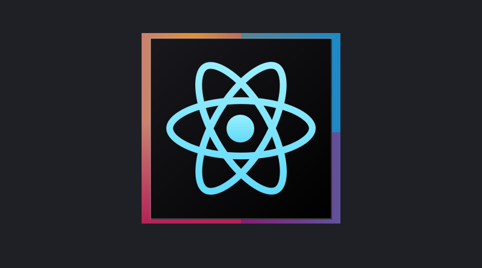

# 𝕸𝖔𝖓𝖎𝖊𝖘𝖍 𝕽𝖆𝖛𝖎𝖈𝖍𝖆𝖓𝖉𝖗𝖗𝖆𝖓

<h3>
𝙄𝙣𝙩𝙚𝙧𝙣 𝙖𝙩 𝙍𝙤𝙘𝙠𝙚𝙩𝙇𝙖𝙣𝙚 | 𝙁𝙪𝙡𝙡 𝙎𝙩𝙖𝙘𝙠 𝘿𝙚𝙫𝙚𝙡𝙤𝙥𝙚𝙧 | 2𝙣𝙙 𝙍𝙪𝙣𝙣𝙚𝙧 𝙐𝙥 𝙤𝙛 𝘾𝙞𝙩𝙮 𝘾𝙤𝙢𝙢𝙖𝙣𝙙 𝙈𝙖𝙥𝙨 𝙖𝙣𝙙 𝙇𝙤𝙘𝙖𝙩𝙞𝙤𝙣 𝙃𝙖𝙘𝙠𝙖𝙩𝙝𝙤𝙣, 𝙁𝙞𝙣𝙖𝙡𝙞𝙨𝙩 𝙞𝙣 2𝙓 𝙉𝙖𝙩𝙞𝙤𝙣𝙖𝙡 𝙃𝙖𝙘𝙠𝙖𝙩𝙝𝙤𝙣𝙨 | 4 ⭐ 𝙞𝙣 𝘾𝙤𝙙𝙚𝘾𝙝𝙚𝙛  | 𝙋𝙪𝙥𝙞𝙡 𝙞𝙣 𝘾𝙤𝙙𝙚𝙁𝙤𝙧𝙘𝙚𝙨 | 𝙎𝙤𝙡𝙫𝙚𝙙 200+ 𝙥𝙧𝙤𝙗𝙡𝙚𝙢𝙨 𝙞𝙣 𝙇𝙚𝙚𝙩𝘾𝙤𝙙𝙚</h3>

 

  

<h3>🔭 𝙸’𝚖 𝚌𝚞𝚛𝚛𝚎𝚗𝚝𝚕𝚢 𝚠𝚘𝚛𝚔𝚒𝚗𝚐 𝚊𝚜 𝚊 𝙵𝚞𝚕𝚕 𝚂𝚝𝚊𝚌𝚔 𝙳𝚎𝚟𝚎𝚕𝚘𝚙𝚎𝚛 𝙸𝚗𝚝𝚎𝚛𝚗 𝙰𝚝 𝚁𝚘𝚌𝚔𝚎𝚝𝙻𝚊𝚗𝚎</h3>
 

<h3>🌱 𝙵𝚒𝚗𝚊𝚕 𝚈𝚎𝚊𝚛 𝙲𝚂𝙴 𝚄𝚗𝚍𝚎𝚛𝚐𝚛𝚊𝚍 𝚊𝚝 𝚂𝚂𝙽 𝙲𝚘𝚕𝚕𝚎𝚐𝚎 𝚘𝚏 𝙴𝚗𝚐𝚒𝚗𝚎𝚎𝚛𝚒𝚗𝚐 𝙲𝚑𝚎𝚗𝚗𝚊𝚒</h3>
 

 
<h3>My Repositories</h3>

  

 
👯 <b>Languages ,Tools and FrameWorks:</b> 
   

 
- 🤔 I’m looking for help with ...
- 💬 Ask me about ...
- 📫 How to reach me: ...
